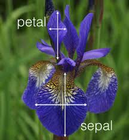

Iris classification
===================

This project is a template implementation of a **classification** problem.  
It can be quickly adapted to fit a **regression** task.

3 implementations are proposed:
1. **Neural network** implemented with Keras
2. **xgboost** implmented with xgboost
3. **Decision tree** implemented with sklearn

There used to be a 4th one, **Neural network** implemented with TensorFlow,
however since TF 2.0 it got all messed up...

*   [1 Installation](#installation)
*   [2 Data](#data)
*   [3 Training](#training)
*   [4 Trained models](#trained-models)
*   [5 Evaluation](#evaluation)
*   [6 Results](#results)

## Installation

The code was tested with Python 3.6.

### Setting up a virtual environment (optional)
```
$ python3 -m pip install --user --upgrade virtualenv
$ python3 -m virtualenv env
```
Sourcing the environment:
```
$ source ./env/bin/activate
```
### Installing the python packages
```
pip3 install -r requirements.txt 
```

## Data

In the **data** folder.

<p align="center">
  
</p>

## Training

For each model in  `models`, the training is performed by running
`train_model.py`.

## Trained models

For each model in `models`, a trained model is saved under `trained_model/model_name.save`.

## Evaluation

An evaluation is performed on a test set at the end of each training.
It is also possible to use the trained model to make prediction
through the `make_pred.py`.

## Results

Any model performs extremely well on the iris dataset ;-)